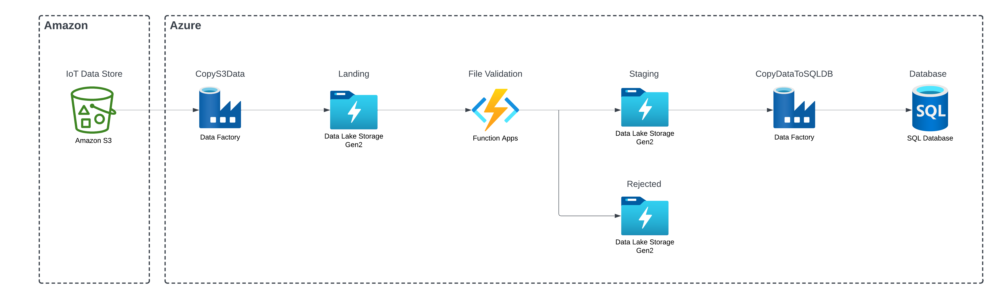

# Smart Vehicle Telemetry Processing
Process smart vehicle telemetry data stored in Amazon S3 and store it in an Azure SQL Database using Azure Data Factory, Azure Data Lake Gen2, and Azure Function Apps.

## Architecture

### Amazon S3
The S3 bucket contains the telemetry data stored in a JSON file. This mocks the storage of IoT Data.

### Azure Data Factory
Used to build ETL pipelines to Move data from one location to another.
1. CopyS3Data: Used to move data from S3 to Data Lake Gen2 (pre-validation, ingestion)
    - Schedule Based Tigger: triggered daily 
2. CopyDataToSQLDB: Used to move data from Data Lake Gen2 to Azure SQL Database (post-validation)
    - Maps the columns to the correct ones in Azure SQL Database
    - Storage Event Based Trigger: triggered when a new file is added to the Staging folder in Data Lake Gen2

### Azure Data Lake Gen2
Used to temporarily store the data.
1. Landing: stores the ingested data after being extracted from S3
2. Staging: stores/stages the data to be copied to Azure SQL Database after being validated by the Functions App script

### Azure Functions App
Validates the file to check if the data is accurate and the file is formatted correctly. It is triggered when a file is added to the Landing folder in Data Lake Gen2. It stores the resulting file in the Staging folder if it is successfully validated and the Rejected folder if the validation is unsuccessful.

### Azure Key Vault
Store the S3 secret key.

### Azure SQL Server
Stores the processed/validated data in a tabular format.

## Steps to Reproduce
1. Create Amazon S3 bucket and upload the telemetry data. Grab the S3 secret key.
2. Create an ADLS Storage account and create the landing, staging and rejected folders.
3. Create an Azure Key Vault and add the S3 secret key.
4. Create an Azure Data Factory Account and then create a pipline (CopyS3Data) to copy the data from S3 to the landing folder in ADLS. Use the S3 secret key in Key Vault to access S3. Use a Schedule based trigger. 
5. Create an Azure Function with blob trigger logic to validate the data and then store it in either staging if successful or rejected if unsuccessful.
6. Create an Azure SQL Server and an Azure SQL Database.
7. Create another pipeline (CopyDataToSQLDB) in Azure Data Factory to extract the data from staging, map the data to the columns in the Azure SQL Database and the store the data in the Azure SQL Database. Use an blob storage event trigger that triggers when a file is added to the staging folder in ADLS.
8. Perform End-to-End testing to ensure the data flows correctly.

## Improvements
- It may be better to use parquet files, especially for files with more rows to allow for faster processing times. Parquet is a compressed column based file format.
- Create an advanced validation script for a better validation of the data. Currently a file is rejected if even a single row is incorrect.
- Delete the files from staging or move them to a completed folder after the pipeline is run. This is especially useful when Azure Data Factory triggers twice randomly.

## Ride Share App
A possible extension of this project is a ride share app. Vehicle telemetry data can be streamed using IoT hub and processed using event hubs, stream analytics, data lake gen2, data factory, azure synapse or databricks. An app to track vehicle location and interact with users can be created using Azure Mobile Apps (Backend) and Flutter or React.js (Frontend).
